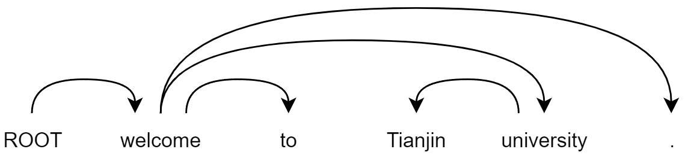

# PerturbedMasking4DepParsing
To induce dependency structures from pre-trained model (an unsupervised dependency schema)

### To parse

#### Input: 

welcome to Tianjin university.

#### Output:

### Related Work
[Perturbed Masking: Parameter-free Probing for Analyzing and
Interpreting BERT
](https://aclanthology.org/2020.acl-main.383.pdf)
